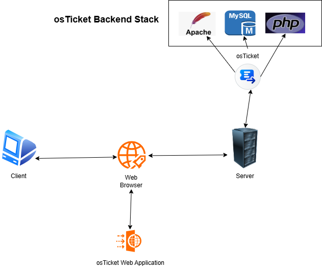
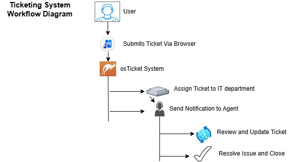

# Helpdesk-Ticketing-System-Lab
This project continues from my previous setup where I created a real-world office environment with a server, client machine, Active Directory Domain Services (AD DS), Group Policies, users, and OUs. In this project, I added the osTicket ticketing system and integrated LDAP authentication.
***

**Technology used** 
---

- **Virtual Box** - Application used to host all virtual Machines.
- **Windows Server 2022** - The main server where Active Directory and osTicket is hosted. 
- **Windows 10 OS Client** - Workstations that users log into and use to submit tickets.
- **Active Directory Domain Services (AD DS)** - Used to manage users, groups and group policies across the domain.
- **osTicket** - Web-based ticketing system used for reporting, tracking and resolving IT issues.
- **Apache** - Web server that hosts the osTicket Application. 
- **MySQL** - Database engine used to store ticket data and user information.
- **phpMyAdmin** - Graphical interface for managing the MySQL database. 
- **PHP** - Server-side scripting language used by Apache to process and display osTicket content on the browser. 
***

**Network Diagram**
---

**Workflow Diagram**
---

**How it works**
---
- Users submit tickets through the osTicket portal
- Tickets are routed to the correct department
- Agents log in using Active Directory (LDAP) authentication
- Agents retrieve, troubleshoot, resolve, and close tickets
- Simple

**Link to the documentation**
---
[Ticketing Sytem Project .pdf](https://github.com/TheNazSec/Helpdesk-Ticketing-System-Lab/blob/39868afb9919cad63eedb6b57f2ee8e806f34f01/Ticketing%20Sytem%20Project%20.pdf)
